# LLM × RAG × 실무 아키텍처 가이드

> **원리부터 운영까지** - AI 개발자와 실무진을 위한 종합 레퍼런스

---

## 🗂️ 목차

- [Executive Summary](#executive-summary)
- [📚 필수 용어 사전](#glossary)
- [🏗️ 1. LLM 기초 아키텍처](#llm-architecture)
- [🔍 2. 검색 시스템 설계](#search-system-design)
- [🚀 3. RAG 시스템 구현](#rag-implementation)
- [📊 4. 평가 및 관측](#evaluation-observability)
- [⚡ 5. 성능 최적화](#performance-optimization)
- [🔒 6. 보안 및 거버넌스](#security-governance)
- [🌏 7. 한국어 특화 고려사항](#korean-considerations)
- [🛠️ 8. 실전 구현 가이드](#practical-guide)
- [📈 9. 성숙도별 로드맵](#maturity-roadmap)
- [🎯 10. 실무 팁과 베스트 프랙티스](#best-practices)
- [🔧 부록: 코드 예시](#appendix-code)
- [📚 추가 학습 자료](#additional-resources)

<a id="executive-summary"></a>

## 🎯 Executive Summary

### 핵심 원칙

- **검색 품질이 LLM 성능을 결정한다** - 좋은 검색 없이는 좋은 답변도 없다
- **하이브리드 접근이 최선이다** - 키워드 검색과 의미 검색의 조합
- **관측과 평가가 성공을 좌우한다** - 측정할 수 없으면 개선할 수 없다

### 구현 로드맵

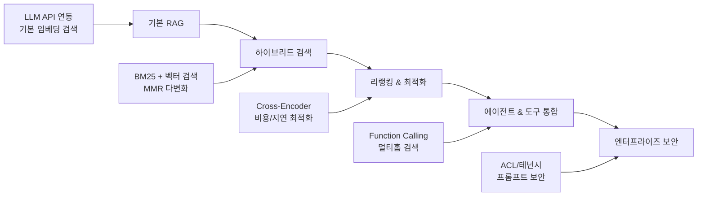

---

<a id="glossary"></a>

## 📚 필수 용어 사전

<details>
<summary><strong>🔤 토큰화 & 모델 기초</strong></summary>

- **토큰화(Tokenization)**: 텍스트를 모델이 이해할 수 있는 단위로 분할
- **멀티바이트/자모 분해**: 한국어 등에서 글자가 자음+모음으로 분해되어 토큰 수 증가
- **RoPE**: 위치 정보를 회전 행렬로 인코딩하는 기법
- **FlashAttention**: GPU 메모리 효율적인 어텐션 계산 방식

</details>

<details>
<summary><strong>🔍 검색 & 임베딩</strong></summary>

- **임베딩(Embedding)**: 텍스트를 고차원 벡터로 변환하여 의미적 유사도 측정 가능
- **BM25**: 키워드 기반 전통적인 검색 알고리즘
- **하이브리드 검색**: BM25 + 벡터 검색의 조합
- **MMR**: 검색 결과의 중복을 줄이고 다양성을 높이는 기법
- **Cross-Encoder**: 쿼리와 문서를 함께 고려한 정밀한 재순위화

</details>

<details>
<summary><strong>🤖 RAG & 에이전트</strong></summary>

- **RAG**: 검색 결과를 LLM에 제공하여 정확한 답변 생성
- **Function Calling**: LLM이 외부 도구나 API를 호출할 수 있는 기능
- **ReAct**: 추론과 행동을 반복하는 에이전트 패턴
- **MCP**: 모델과 외부 도구 간 안전한 상호작용 프로토콜

</details>

<details>
<summary><strong>⚙️ 모델 최적화</strong></summary>

- **양자화(Quantization)**: 16/8/4/2-bit로 가중치·활성값 정밀도 감소해 메모리·지연 절감
- **LoRA/QLoRA**: 저랭크 어댑터를 활용한 경량 파인튜닝(저비용·저메모리)
- **AWQ/GPTQ**: 가중치 전용 양자화 알고리즘으로 정확도 손실 최소화
- **Speculative Decoding**: 초안 모델로 후보 토큰을 제안해 대형 모델 검증으로 속도 향상
- **FlashAttention-2 / PagedAttention**: 대규모 시퀀스 효율적 처리로 지연·메모리 최적화
- **연속 배칭(Continuous Batching)**: KV 캐시 재사용과 동적 배치로 처리량 극대화

</details>

<details>
<summary><strong>🧠 검색 고도화</strong></summary>

- **RRF(Reciprocal Rank Fusion)**: 서로 다른 검색 결과를 역순위 합으로 병합
- **SPLADE/ColBERT**: 스파스/롱토큰 친화적 표현으로 정밀 검색 지원
- **하이브리드 가중치**: BM25·벡터 점수 정규화 후 가중 합산으로 최적 결합
- **쿼리 확장(Query Expansion)**: PRF/LLM 기반 동의어·관련 키워드 자동 확장
- **중복 제거 & 다양화**: MMR/클러스터링으로 유사 청크 제거, 커버리지 향상

</details>

<details>
<summary><strong>🏃 런타임 & 배포</strong></summary>

- **서빙 엔진**: vLLM, TGI, TensorRT-LLM, Ollama 등 최적화 런타임
- **스트리밍/배치**: SSE/웹소켓 스트리밍과 배치 처리로 체감 속도·처리량 개선
- **캐시 계층**: 임베딩/검색 결과/프롬프트/응답 캐시로 비용·지연 절감
- **모델 라우팅**: 난이도 기반 소형↔대형 모델 전환 및 폴백 전략
- **관측성**: 트레이싱, 토큰 사용량, 지연·오류 메트릭 수집

</details>

<details>
<summary><strong>🧪 평가 & 자동화</strong></summary>

- **LLM-as-a-Judge**: 기준표 기반 자동 채점으로 생성 품질 평가
- **골든셋/회귀 스위트**: 변경 시 품질 퇴행 탐지용 고정 벤치마크
- **페어와이즈 선호/랭킹**: A/B 응답 비교로 선호도 학습 및 ELO 산정
- **커버리지 분석**: 도메인별 질문 분포와 테스트 결핍 구간 파악

</details>

<details>
<summary><strong>🔐 보안 & 거버넌스 용어</strong></summary>

- **PII 마스킹/DLP**: 개인정보 탐지·비식별화로 데이터 유출 방지
- **테넌트 분리/ACL**: 사용자·조직 단위 접근 제어 및 데이터 경계 보장
- **프롬프트 주입 방어**: 입력 검증, 컨텍스트 샌드박싱, 출력 필터링
- **감사 로깅**: 질의·검색·생성 이력 추적 및 규제 대응

</details>

---

<a id="llm-architecture"></a>

## 🏗️ 1. LLM 기초 아키텍처

### 1.1 Transformer 핵심 구조

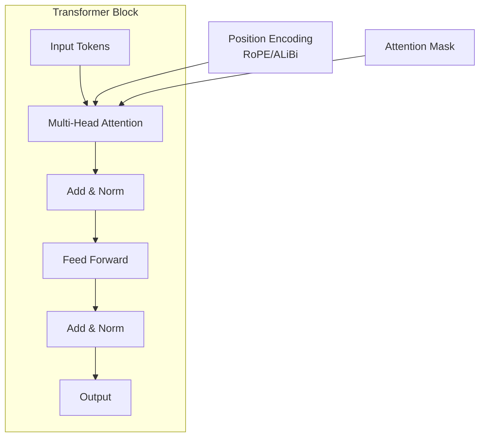

### 1.2 학습 패러다임

| 단계             | 목적           | 특징                               |
| ---------------- | -------------- | ---------------------------------- |
| **Pre-training** | 언어 모델링    | 대량 텍스트로 기본 언어 이해       |
| **SFT**          | 태스크 특화    | 지도학습으로 특정 형식/스타일 학습 |
| **RLHF/DPO**     | 인간 선호 반영 | 더 유용하고 안전한 응답 생성       |

### 1.3 추론 최적화 기법

- **KV Cache**: 이전 토큰의 키-값 쌍을 캐시하여 속도 향상
- **샘플링 전략**: Temperature, Top-p, Top-k로 창의성과 일관성 조절
- **배치 처리**: 여러 요청을 동시에 처리하여 throughput 향상

---

<a id="search-system-design"></a>

## 🔍 2. 검색 시스템 설계

### 2.1 검색 방식 비교

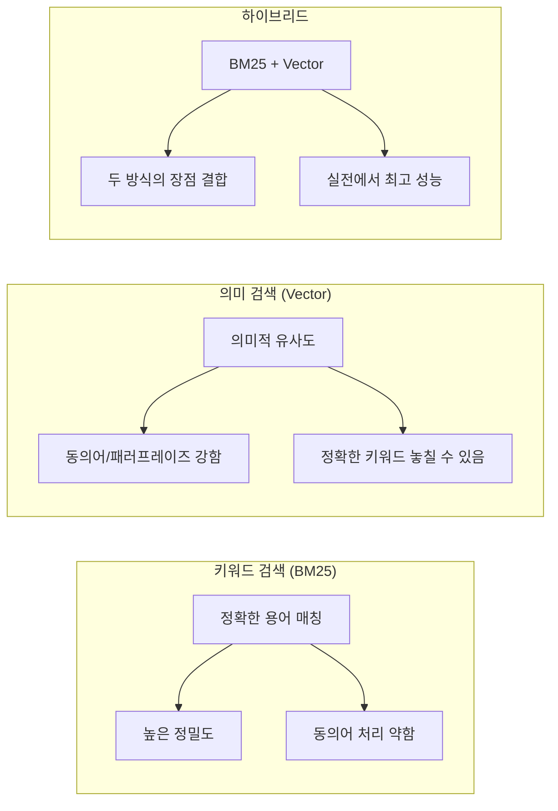

### 2.2 인덱싱 파이프라인

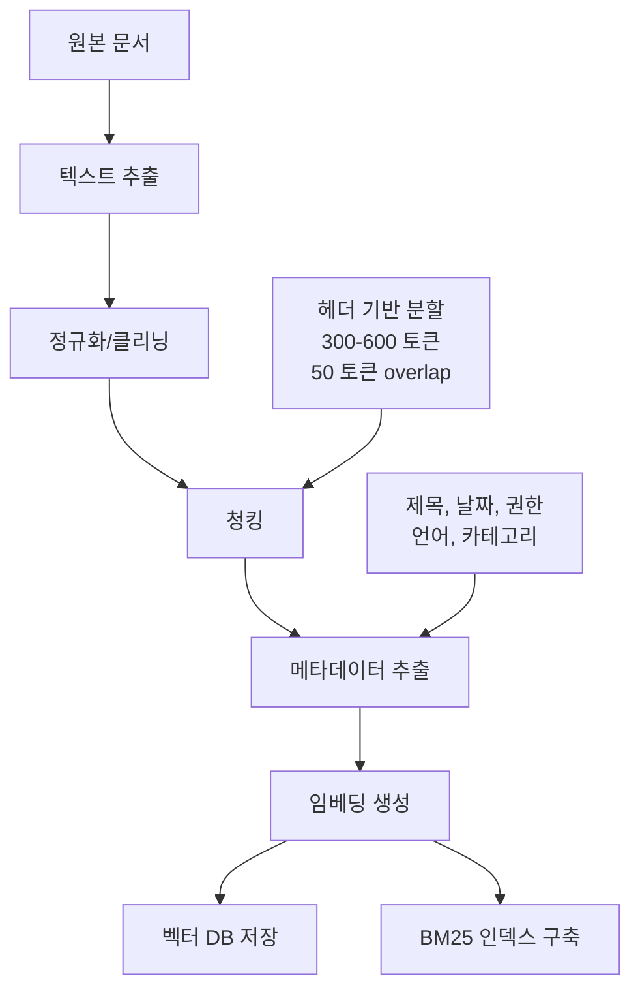

### 2.3 검색 품질 지표

| 지표         | 설명                                  | 목표값 |
| ------------ | ------------------------------------- | ------ |
| **Recall@k** | 상위 k개에 정답이 포함된 비율         | >90%   |
| **MRR**      | 첫 번째 정답의 역순위 평균            | >0.7   |
| **nDCG@k**   | 순위를 고려한 정규화된 할인 누적 이득 | >0.8   |

---

<a id="rag-implementation"></a>

## 🚀 3. RAG 시스템 구현

### 3.1 기본 RAG 플로우

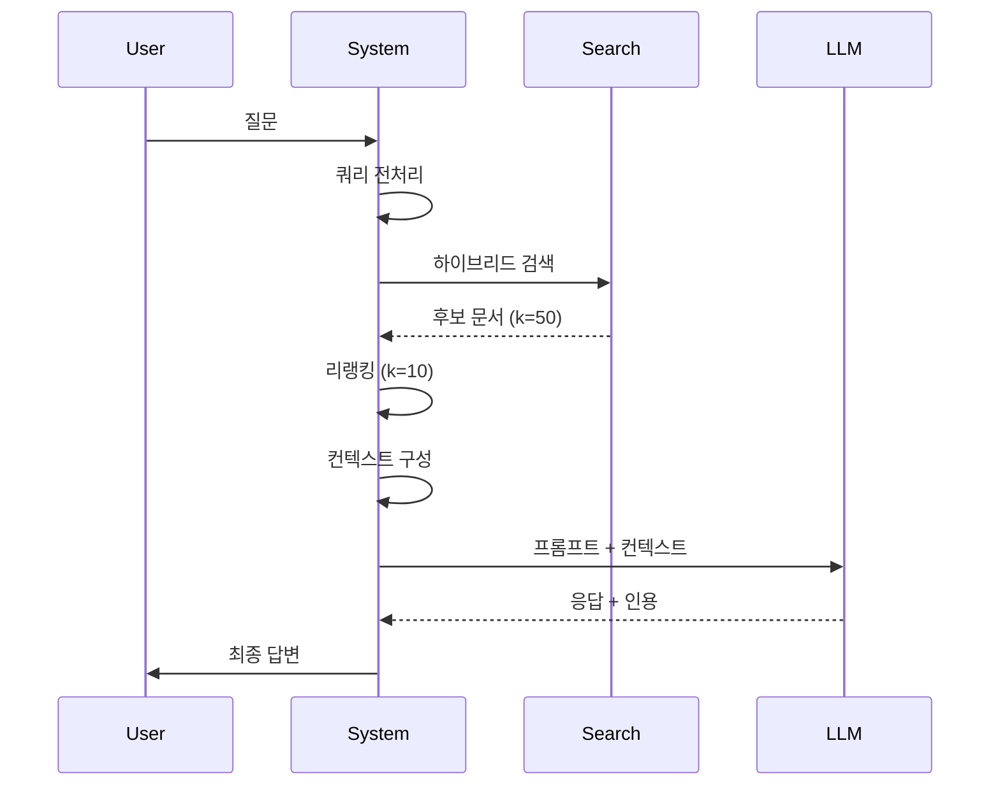

### 3.2 고급 RAG 패턴

#### Self-Ask / ReAct 패턴

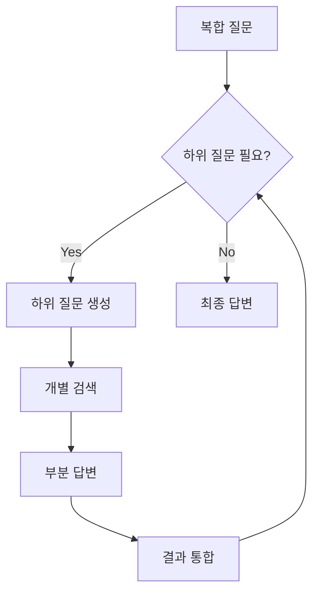

#### Multi-Hop 검색

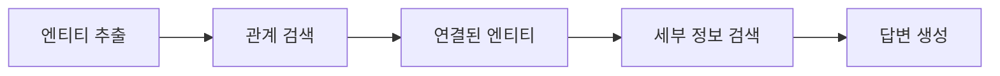

### 3.3 프롬프트 구조 템플릿

```typescript
interface RAGPromptTemplate {
  system: string;
  context: ContextBlock[];
  query: string;
  constraints: string[];
  outputFormat: JSONSchema;
}

interface ContextBlock {
  id: string;
  title: string;
  content: string;
  metadata: {
    source: string;
    date: string;
    score: number;
  };
}
```

---

<a id="evaluation-observability"></a>

## 📊 4. 평가 및 관측

### 4.1 평가 프레임워크

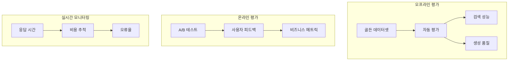

### 4.2 핵심 메트릭

#### 검색 품질

- **Recall@10**: 상위 10개 결과에 정답 포함률
- **MRR (Mean Reciprocal Rank)**: 첫 정답의 역순위 평균
- **Coverage**: 전체 질문 영역 커버리지

#### 생성 품질

- **Faithfulness**: 생성된 답변이 검색된 컨텍스트에 충실한 정도
- **Citation Rate**: 적절한 출처 인용 비율
- **Hallucination Rate**: 근거 없는 내용 생성 비율

---

<a id="performance-optimization"></a>

## ⚡ 5. 성능 최적화

### 5.1 비용 최적화 전략

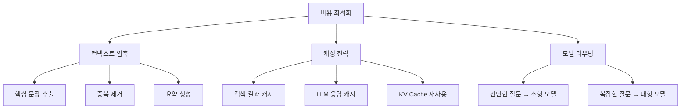

### 5.2 지연시간 최적화

| 최적화 기법        | 효과                      | 구현 복잡도 |
| ------------------ | ------------------------- | ----------- |
| **벡터 DB 최적화** | 검색 속도 2-5배 향상      | 중          |
| **배치 처리**      | throughput 3-10배 향상    | 중          |
| **스트리밍 응답**  | 체감 속도 대폭 개선       | 낮음        |
| **캐싱**           | 반복 질의 10-100배 빨라짐 | 낮음        |

---

<a id="security-governance"></a>

## 🔒 6. 보안 및 거버넌스

### 6.1 보안 위협과 대응

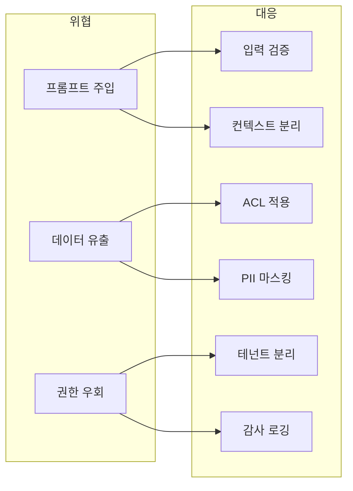

### 6.2 프롬프트 주입 방어

```typescript
interface SecurityGuard {
  validateInput(query: string): boolean;
  detectInjection(prompt: string): boolean;
  sanitizeContext(context: string): string;
  enforceACL(userId: string, documentId: string): boolean;
}

// 예시: 입력 검증
function validateQuery(query: string): boolean {
  const suspiciousPatterns = [
    /ignore.*previous.*instruction/i,
    /you.*are.*now/i,
    /system.*prompt/i,
  ];

  return !suspiciousPatterns.some((pattern) => pattern.test(query));
}
```

---

<a id="korean-considerations"></a>

## 🌏 7. 한국어 특화 고려사항

### 7.1 한국어 처리 특성

| 특성            | 문제점                          | 해결방안               |
| --------------- | ------------------------------- | ---------------------- |
| **교착어 구조** | 조사 변화로 키워드 매칭 어려움  | 형태소 분석, 어간 추출 |
| **띄어쓰기**    | 불규칙한 띄어쓰기로 토큰화 이슈 | 정규화, 문장 단위 청킹 |
| **한영 혼용**   | 일관성 없는 표기                | 멀티링구얼 임베딩      |

### 7.2 한국어 최적화 파이프라인

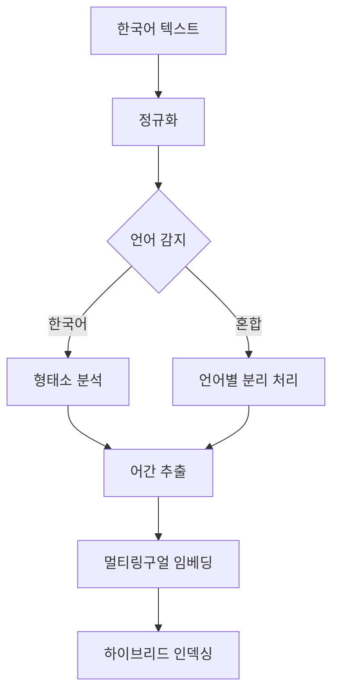

---

<a id="practical-guide"></a>

## 🛠️ 8. 실전 구현 가이드

### 8.1 기술 스택 추천

#### 검색 엔진

- **Elasticsearch**: BM25 + 하이브리드 검색
- **Pinecone/Weaviate**: 관리형 벡터 DB
- **FAISS**: 오픈소스 벡터 인덱스

#### LLM 플랫폼

- **OpenAI GPT-4**: 범용성과 안정성
- **Anthropic Claude**: 긴 컨텍스트 처리
- **로컬 모델**: 비용 효율성과 데이터 보안

### 8.2 구현 체크리스트

#### Phase 1: 기본 RAG

- [ ] 문서 인덱싱 파이프라인 구축
- [ ] 기본 임베딩 검색 구현
- [ ] 간단한 프롬프트 템플릿 작성
- [ ] 기본적인 답변 생성 테스트

#### Phase 2: 하이브리드 검색

- [ ] BM25 인덱스 추가
- [ ] 검색 결과 병합 로직 구현
- [ ] MMR 다변화 적용
- [ ] 검색 품질 평가 메트릭 구축

#### Phase 3: 고도화

- [ ] Cross-encoder 리랭킹 추가
- [ ] 캐싱 시스템 구현
- [ ] 비용/지연 최적화
- [ ] A/B 테스트 환경 구축

#### Phase 4: 엔터프라이즈

- [ ] 권한 관리 시스템
- [ ] 감사 로깅
- [ ] 프롬프트 주입 방어
- [ ] 멀티테넌트 지원

---

<a id="maturity-roadmap"></a>

## 📈 9. 성숙도별 로드맵

### Beginner (0-3개월)

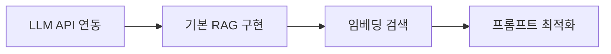

**목표**: 동작하는 RAG 시스템 구축
**핵심 스킬**: API 사용법, 기본 임베딩, 프롬프트 엔지니어링

### Intermediate (3-9개월)

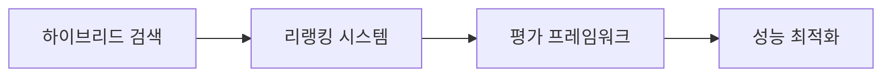

**목표**: 프로덕션 레디 시스템
**핵심 스킬**: 검색 알고리즘, 평가 메트릭, 성능 튜닝

### Advanced (9개월+)

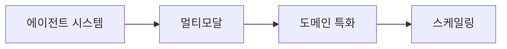

**목표**: 복잡한 AI 애플리케이션 아키텍팅
**핵심 스킬**: 시스템 설계, 보안, 운영

---

<a id="best-practices"></a>

## 🎯 10. 실무 팁과 베스트 프랙티스

### 10.1 자주 하는 실수들

❌ **Bad Practice**

- 검색 없이 LLM만으로 팩트 질문 답변
- 너무 긴 컨텍스트로 토큰 낭비
- 검색 품질 측정 없이 시스템 운영
- 보안 고려 없는 사용자 입력 처리

✅ **Good Practice**

- 불확실한 정보는 반드시 검색으로 확인
- 컨텍스트는 짧고 정확하게
- 지속적인 품질 모니터링과 개선
- 입력 검증과 출력 필터링 필수

### 10.2 성능 튜닝 가이드

1. **검색 최적화**

   - 청킹 크기: 300-600 토큰이 적절
   - Overlap: 50-100 토큰으로 컨텍스트 보존
   - 리랭킹: 상위 10-20개만 선별하여 비용 절약

2. **프롬프트 최적화**

   - 명확한 역할과 제약 조건 명시
   - 예시 기반 few-shot 학습 활용
   - JSON 스키마로 출력 형식 강제

3. **모니터링 포인트**
   - 응답 시간: 2초 이내 목표
   - 토큰 사용량: 월별 예산 관리
   - 사용자 만족도: 피드백 수집 필수

---

<a id="appendix-code"></a>

## 🔧 부록: 코드 예시

### A.1 기본 RAG 파이프라인

```typescript
interface Document {
  id: string;
  content: string;
  metadata: {
    title: string;
    source: string;
    date: Date;
  };
}

interface SearchResult {
  document: Document;
  score: number;
  snippet: string;
}

class RAGPipeline {
  private vectorStore: VectorStore;
  private bm25Index: BM25Index;
  private llm: LLMClient;

  async search(query: string, topK: number = 10): Promise<SearchResult[]> {
    // 하이브리드 검색
    const vectorResults = await this.vectorStore.search(query, topK * 2);
    const bm25Results = await this.bm25Index.search(query, topK * 2);

    // RRF로 결과 병합
    const mergedResults = this.mergeWithRRF(vectorResults, bm25Results);

    // 상위 결과 반환
    return mergedResults.slice(0, topK);
  }

  async generateAnswer(
    query: string,
    context: SearchResult[]
  ): Promise<string> {
    const prompt = this.buildPrompt(query, context);
    const response = await this.llm.generate(prompt, {
      temperature: 0.1,
      maxTokens: 1000,
      jsonSchema: {
        type: "object",
        properties: {
          answer: { type: "string" },
          citations: {
            type: "array",
            items: { type: "string" },
          },
        },
      },
    });

    return response.answer;
  }

  private mergeWithRRF(
    results1: SearchResult[],
    results2: SearchResult[],
    k: number = 60
  ): SearchResult[] {
    const scoreMap = new Map<string, number>();

    // 첫 번째 결과셋 점수 계산
    results1.forEach((result, index) => {
      const score = 1 / (k + index + 1);
      scoreMap.set(result.document.id, score);
    });

    // 두 번째 결과셋 점수 추가
    results2.forEach((result, index) => {
      const score = 1 / (k + index + 1);
      const existing = scoreMap.get(result.document.id) || 0;
      scoreMap.set(result.document.id, existing + score);
    });

    // 점수순으로 정렬하여 반환
    return Array.from(scoreMap.entries())
      .sort((a, b) => b[1] - a[1])
      .map(([docId, score]) => {
        const doc = this.findDocument(docId);
        return { document: doc, score, snippet: this.extractSnippet(doc) };
      });
  }
}
```

### A.2 평가 시스템

```typescript
interface EvaluationMetric {
  name: string;
  score: number;
  details?: Record<string, any>;
}

class RAGEvaluator {
  async evaluateRetrieval(
    queries: string[],
    relevantDocs: string[][]
  ): Promise<EvaluationMetric[]> {
    const results: EvaluationMetric[] = [];

    for (let i = 0; i < queries.length; i++) {
      const retrieved = await this.ragPipeline.search(queries[i], 10);
      const retrievedIds = retrieved.map((r) => r.document.id);

      // Recall@10 계산
      const relevant = relevantDocs[i];
      const intersection = retrievedIds.filter((id) => relevant.includes(id));
      const recall = intersection.length / relevant.length;

      results.push({
        name: "recall@10",
        score: recall,
        details: { query: queries[i], relevant, retrieved: retrievedIds },
      });
    }

    return results;
  }

  async evaluateGeneration(
    queries: string[],
    expectedAnswers: string[]
  ): Promise<EvaluationMetric[]> {
    const results: EvaluationMetric[] = [];

    for (let i = 0; i < queries.length; i++) {
      const context = await this.ragPipeline.search(queries[i]);
      const generated = await this.ragPipeline.generateAnswer(
        queries[i],
        context
      );

      // LLM-as-a-Judge로 품질 평가
      const faithfulness = await this.evaluateFaithfulness(generated, context);
      const relevance = await this.evaluateRelevance(generated, queries[i]);

      results.push(
        { name: "faithfulness", score: faithfulness },
        { name: "relevance", score: relevance }
      );
    }

    return results;
  }
}
```

---

<a id="additional-resources"></a>

## 📚 추가 학습 자료

### 필수 논문

- **RAG**: "Retrieval-Augmented Generation for Knowledge-Intensive NLP Tasks"
- **DPR**: "Dense Passage Retrieval for Open-Domain Question Answering"
- **FiD**: "Leveraging Passage Retrieval with Generative Models"

### 오픈소스 프로젝트

- **LangChain**: RAG 구현을 위한 종합 프레임워크
- **LlamaIndex**: 인덱싱과 검색에 특화된 라이브러리
- **Haystack**: 엔터프라이즈급 검색 파이프라인

### 평가 데이터셋

- **MS MARCO**: 검색 품질 평가용
- **Natural Questions**: 실제 질문-답변 쌍
- **BEIR**: 다양한 도메인의 검색 벤치마크

---

RAG 시스템은 반복적 개선이 핵심입니다. 작게 시작해서 사용자 피드백을 통해 지속적으로 발전시키세요. 완벽한 시스템을 한 번에 만들려고 하지 말고, 측정 가능한 지표를 설정하고 단계별로 개선해나가는 것이 성공의 열쇠입니다.
